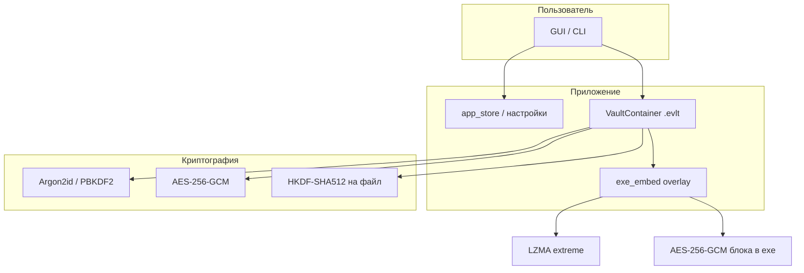

# Encrypted Vault

**Encrypted Vault** — программа для безопасного хранения произвольных файлов в одном зашифрованном контейнере. Подходит для личных архивов, резервных копий документов и любых данных, которые нужно держать под паролем и при желании — открывать только в заданный период времени.

Доступны **графический интерфейс (GUI)** для повседневной работы и **командная строка (CLI)** для скриптов. На Windows можно собрать один исполняемый файл `EncryptedVault.exe`, в который встраивается само хранилище.

---

## Содержание

- [Назначение и идея](#назначение-и-идея)
- [Возможности программы](#возможности-программы)
- [Архитектура и уровни защиты](#архитектура-и-уровни-защиты)
- [Требования](#требования)
- [Установка](#установка)
- [Быстрый старт](#быстрый-старт)
- [Графический интерфейс](#графический-интерфейс)
- [Командная строка](#командная-строка)
- [Режимы защиты контейнера](#режимы-защиты-контейнера)
- [Формат контейнера .evlt](#формат-контейнера-evlt)
- [Встроенное хранилище в exe](#встроенное-хранилище-в-exe)
- [Настройки безопасности](#настройки-безопасности)
- [Блокировка по времени (timelock)](#блокировка-по-времени-timelock)
- [Сборка исполняемого файла](#сборка-исполняемого-файла)
- [Структура проекта](#структура-проекта)
- [Ограничения и рекомендации](#ограничения-и-рекомендации)
- [Лицензия](#лицензия)
- [Шпаргалка команд](#шпаргалка-команд)

---

## Назначение и идея

Обычные папки и ZIP-архивы с паролем не дают гибкой защиты от перебора, привязки ко времени и «встроенного» переносимого хранилища. Encrypted Vault решает это так:

1. Все файлы лежат в **одном контейнере** с криптостойким форматом.
2. Каждый файл внутри шифруется **отдельным ключом**.
3. В GUI хранилище может жить **внутри exe** — переносите одну программу (и при необходимости папку `data\`).
4. Опционально — **лимит попыток пароля** с уничтожением контейнера и **открытие только после даты** с проверкой времени по интернету.

Программа не заменяет полноценное управление секретами в организации (Vault, HSM), но даёт сильную локальную защиту для одного пользователя и одного компьютера.

---

## Возможности программы

### Хранение и работа с файлами

- Один контейнер **`.evlt`** с неограниченным числом файлов внутри.
- **Добавление**, **извлечение**, **удаление** файлов (GUI и CLI).
- Сохранение **даты изменения** (mtime) в метаданных.
- Имена файлов внутри контейнера задаются при добавлении (`-n` в CLI).

### Криптография

- **AES-256-GCM** для данных и служебных блоков (аутентифицированное шифрование).
- **Argon2id** для вывода мастер-ключа из пароля (настраиваемые память и время).
- **HKDF-SHA512** — отдельный ключ на каждый файл в контейнере.
- Поддержка **legacy-контейнеров v1** (PBKDF2-SHA256, 600 000 итераций).
- Опциональный **`kdf_pepper`** в настройках — дополнительный секрет для KDF (хранить отдельно от контейнера).

### Защита от перебора пароля

- Счётчик неудачных попыток (в зашифрованном виде в заголовке v2+).
- **Нарастающая задержка** после ошибки: `min_delay × multiplier^attempt` (с потолком `max_delay`).
- Настраиваемый **лимит попыток**; при превышении — **безвозвратное уничтожение** контейнера (если включено в настройках).

### Временная блокировка (timelock)

- Открытие только **не раньше** заданной даты/времени (UTC).
- Опционально — закрытие **после** второй даты (`unlock_before`).
- Проверка времени по **нескольким сетевым источникам** (API, HTTP Date, NTP) и сверка с **локальными часами**.
- Режимы: только время, только пароль, **пароль + время**.

### Графический интерфейс

- **Встроенное хранилище** — не нужно выбирать внешний `.evlt` вручную.
- **Пароль входа в программу** (отдельно от пароля хранилища), хэш Argon2 в `app_config.json`.
- **Первый запуск**: окно с описанием программы → мастер настройки → создание контейнера.
- **Следующие запуски**: вход (если настроен) → **предупреждение** о лимите пароля и/или датах timelock → главное окно.
- Окно **«Настройки»** (вкладки: Пароли, Защита, Время, Система).
- Длительные операции (Argon2, открытие) — в **фоновом потоке**, интерфейс не зависает.

### Командная строка

- Полный набор команд: `create`, `add`, `list`, `extract`, `remove`, `passwd`, `info`, `timelock`, `config`.
- Работа с **внешними** файлами `.evlt` (путь `-c`).
- Удобно для автоматизации и CI.

### Сборка под Windows

- **`build_exe.bat`** — чистая сборка `EncryptedVault.exe` без пользовательских данных.
- Контейнер при работе exe **вшивается в файл программы** (сжатие LZMA + дополнительное AES-256-GCM).
- Служебные настройки — в папке `data\` рядом с exe.

---

## Архитектура и уровни защиты



| Уровень | Что защищается | Технологии |
|--------|----------------|------------|
| **Файлы в контейнере** | Содержимое каждого файла | Argon2id → мастер-ключ → HKDF → AES-GCM |
| **Заголовок контейнера** | Проверка пароля, счётчик попыток, timelock | AES-GCM, зашифрованные метки |
| **Блок в exe** (только собранная программа) | Весь файл `.evlt` целиком | LZMA (max) + AES-256-GCM + HKDF-ключ вшивания |
| **Пароль входа в GUI** | Запуск программы | Argon2-хэш в `app_config.json` (не контейнер) |

---

## Требования

| Компонент | Версия / примечание |
|-----------|---------------------|
| Python | 3.10+ |
| cryptography | ≥ 42.0.0 |
| argon2-cffi | ≥ 23.1.0 |
| tkinter | для GUI (часто уже в установке Python на Windows) |
| PyInstaller | ≥ 6.0 (только для сборки exe) |
| Сеть | для timelock с проверкой времени (NTP, HTTP API) |

---

## Установка

### Из исходников

```powershell
cd encrypted-vault
pip install -r requirements.txt
```

Установка как пакета (опционально):

```powershell
pip install -e .
```

### Скрипты Windows

| Файл | Назначение |
|------|------------|
| `install.bat` | Установка зависимостей |
| `Запуск GUI.bat` | Запуск графического интерфейса |
| `run_gui_debug.bat` | GUI с выводом ошибок в консоль |
| `build_exe.bat` | Сборка `dist\EncryptedVault.exe` |

---

## Быстрый старт

### GUI

```powershell
python run_gui.py
```

**Первый запуск**

1. Окно **«О программе»** — описание возможностей.
2. **Мастер настройки** — пароль входа (опционально), пароль хранилища (опционально), создание встроенного контейнера.
3. Главное окно — работа с файлами.

**Следующие запуски**

1. Вход в программу (если задан пароль входа).
2. **Предупреждение** (если настроены лимит пароля и/или timelock).
3. Главное окно.

### CLI (отдельный файл контейнера)

```powershell
python main.py create -c myvault.evlt --protection password
python main.py add -c myvault.evlt document.pdf
python main.py list -c myvault.evlt
python main.py extract -c myvault.evlt document.pdf -o .
```

Справка: `python main.py --help`, `python main.py create --help`.

---

## Графический интерфейс

### Где что хранится

| Данные | Разработка (`python run_gui.py`) | `EncryptedVault.exe` |
|--------|----------------------------------|----------------------|
| **Файлы пользователя (контейнер)** | `data/vault.evlt` | **Внутри exe** (overlay в хвосте файла) |
| **Настройки безопасности** | `data/vault-settings.json` | `data/vault-settings.json` |
| **Пароль входа, флаги** | `data/app_config.json` | `data/app_config.json` |
| **Журнал ошибок** | `data/vault-error.log` | `data/vault-error.log` |

При первом запуске `vault-settings.json` создаётся из `vault-settings.example.json` или со значениями по умолчанию.

**Перенос на другой ПК (exe):** скопируйте `EncryptedVault.exe` и папку `data\` (если уже создана). Хранилище файлов находится внутри exe.

### Сценарий запуска

```
Первый запуск
  → Описание программы
  → Настройка (пароли, создание контейнера)
  → Главное окно

Повторный запуск
  → Вход в программу (если включён)
  → Предупреждение о безопасности
  → Главное окно → открытие хранилища
```

**Предупреждение при запуске** показывает:

- число допустимых **неверных вводов пароля** хранилища и факт **уничтожения** контейнера (если `max_failed_attempts > 0`);
- **даты открытия/закрытия** по UTC, если в контейнере включён timelock.

### Главное окно

- Таблица файлов: имя, размер, дата.
- **Добавить файл…** — выбор с диска.
- **Извлечь…** — сохранение выбранного файла на диск.
- **Удалить** — удаление из контейнера.
- **Обновить** — обновить список.
- **Сменить пароль хранилища** (если контейнер с паролем).
- **О хранилище** — режим защиты, размер, число файлов.
- **Настройки** — редактирование `vault-settings.json` и пароля входа.

### Два пароля в GUI

| Пароль | Назначение | Где хранится |
|--------|------------|--------------|
| **Входа в программу** | Не пустить посторонних в GUI | Argon2-хэш в `app_config.json` |
| **Хранилища** | Расшифровка контейнера с файлами | Внутри криптографии `.evlt` / exe |

Пароли могут совпадать или быть разными.

### Окно «Настройки»

| Вкладка | Содержимое |
|---------|------------|
| **Пароли** | Смена пароля входа в программу |
| **Защита** | Лимит попыток, задержки, Argon2id, pepper |
| **Время** | Параметры проверки сетевого времени для timelock |
| **Система** | Путь к `data\`, сброс настроек по умолчанию |

---

## Командная строка

Точка входа: `main.py` или `python -m vault`.

### Общие параметры

| Параметр | Описание |
|----------|----------|
| `-c`, `--container` | Путь к `.evlt` (по умолчанию `vault.evlt`) |
| `-p`, `--password` | Пароль (не используется при открытии чистого `timelock`) |
| `--settings-file` | Явный путь к `vault-settings.json` |

### Команды

| Команда | Действие |
|---------|----------|
| `create` | Создать контейнер (`--protection`, `--unlock-after`, `--unlock-before`) |
| `add` | Добавить файл (`-n` — имя в архиве) |
| `list` / `ls` | Список файлов |
| `extract` | Извлечь (`-o` — каталог) |
| `remove` / `rm` | Удалить из контейнера |
| `passwd` | Сменить пароль |
| `info` | Версия формата, KDF, защита, timelock, статистика |
| `timelock` | `--status`, `--check-time`, `--enable`, `--disable` |
| `config` | `--init`, `--show`, `--set key=value` |

### Примеры timelock (CLI)

```powershell
python main.py timelock -c vault.evlt --status
python main.py timelock --check-time
python main.py timelock -c vault.evlt --enable --after "2026-06-01 00:00:00"
python main.py timelock -c vault.evlt --disable
```

> В CLI контейнер всегда **отдельный файл** `.evlt`. Вшивание в exe используется только в GUI собранной программы.

---

## Режимы защиты контейнера

| Режим | Пароль | Timelock | Применение |
|-------|--------|----------|------------|
| `password` | Обязателен | Нет | Универсальное зашифрованное хранилище |
| `timelock` | **Не используется** | Обязателен (`--unlock-after`) | «Открыть после даты» без пароля |
| `both` | Обязателен | Обязателен | Пароль + окно по UTC |

### Примеры создания

```powershell
# Только пароль
python main.py create -c vault.evlt --protection password

# Открыть не раньше даты (UTC), без пароля
python main.py create -c release.evlt --protection timelock `
  --unlock-after "2026-12-01 00:00:00"

# Пароль + окно доступа
python main.py create -c secure.evlt --protection both `
  --unlock-after "2026-06-01 00:00:00" `
  --unlock-before "2026-12-31 23:59:59"
```

Формат даты: `YYYY-MM-DD HH:MM:SS` в **UTC**.

> **Режим `timelock` без пароля:** после наступления `unlock_after` любой, у кого есть файл контейнера (или exe с вшитым хранилищем), может его открыть. Защитите носитель (диск, флешка, права доступа) до нужной даты.

---

## Формат контейнера .evlt

### Общее

- Сигнатура: **`EVLT`**
- Внутри: зашифрованный JSON-манифест со списком файлов + зашифрованные blob'ы подряд.

### Версии

| Версия | KDF | Особенности |
|--------|-----|-------------|
| **v1** | PBKDF2-SHA256, 600 000 итераций | Legacy, один ключ на файлы |
| **v2** | Argon2id | Счётчик попыток в зашифрованном блоке |
| **v3** | Argon2id | Режим `password` / `timelock` / `both`, печать timelock |

### Поведение при неверном пароле

1. Увеличивается счётчик (v2+).
2. Задержка: `min_delay_seconds × delay_multiplier^(attempt-1)`, не больше `max_delay_seconds`.
3. При `fail_open >= max_failed_attempts` и `destroy_on_max_attempts: true` — **перезапись и удаление** контейнера (`secure_destroy`).

---

## Встроенное хранилище в exe

Только для **собранного** `EncryptedVault.exe` (режим PyInstaller, `sys.frozen`).

### Как это работает

1. При создании/изменении файлов контейнер собирается во временный `.evlt`.
2. Перед записью в exe: **LZMA2** (preset extreme) → **AES-256-GCM** (ключ HKDF от pepper и встроенного секрета).
3. Результат дописывается в **хвост exe** с меткой `EVLTEND1`.
4. При открытии: чтение хвоста → расшифровка → распаковка → работа с `.evlt` в памяти/временном файле.

Старые вшивания **v1** (сырой `.evlt` без сжатия/обёртки) по-прежнему читаются; при следующем сохранении переводятся на **v2**.

### Что не в exe

- `vault-settings.json`, `app_config.json`, `vault-error.log` — в папке **`data\`** рядом с программой.

### Сборка

`build_exe.bat` очищает `dist/` и `build/`, собирает только код. В `dist/`:

- `EncryptedVault.exe`
- `README.txt` (краткая справка для пользователя)

До первого запуска в exe **нет** пользовательских данных — как чистая установка.

---

## Настройки безопасности

Файл: **`data/vault-settings.json`** (шаблон: `vault-settings.example.json`).

CLI ищет настройки также в `./vault-settings.json`, `%APPDATA%\encrypted-vault\`, `~/.encrypted-vault/`.

### Защита пароля

| Параметр | По умолчанию | Описание |
|----------|--------------|----------|
| `max_failed_attempts` | `5` | Лимит ошибок; `0` — отключить |
| `destroy_on_max_attempts` | `true` | Уничтожить контейнер при лимите |
| `min_delay_seconds` | `3.0` | Базовая пауза после ошибки (с) |
| `delay_multiplier` | `2.0` | Множитель паузы |
| `max_delay_seconds` | `180.0` | Максимальная пауза (с) |
| `argon2_time_cost` | `4` | «Тяжесть» Argon2id |
| `argon2_memory_kib` | `262144` | Память Argon2 (256 MiB) |
| `argon2_parallelism` | `4` | Потоки Argon2 |
| `kdf_pepper` | `""` | Доп. секрет (усиливает KDF и ключ вшивания в exe) |

### Проверка времени (timelock)

| Параметр | По умолчанию | Описание |
|----------|--------------|----------|
| `time_lock_require_network` | `true` | Требовать согласованное время из сети |
| `time_lock_require_local_match` | `true` | Сверять локальные часы с сетью |
| `time_lock_min_network_sources` | `3` | Минимум источников в «кворуме» |
| `time_lock_network_agreement_seconds` | `120` | Допуск между источниками (с) |
| `time_lock_max_local_skew_seconds` | `300` | Допуск смещения локальных часов (с) |
| `time_lock_allow_offline` | `false` | Разрешить только локальные часы |

### Источники времени

- worldtimeapi.org  
- timeapi.io  
- HTTP `Date`: google.com, microsoft.com  
- Cloudflare trace (`ts=`)  
- NTP: `pool.ntp.org`, `time.google.com`  
- Локальные часы UTC (сверка)

Проверка без контейнера: `python main.py timelock --check-time`.

---

## Блокировка по времени (timelock)

- **`unlock_after`** — раньше этой метки UTC контейнер **не открывается** (в т.ч. в режиме `both` с верным паролем).
- **`unlock_before`** — после этой метки доступ **закрыт**.

В режиме **`timelock`** ключ выводится из параметров времени и соли (без пароля пользователя). В режиме **`both`** нужны и пароль, и прохождение проверки времени.

Подделка даты на одном только ПК обычно **недостаточна**, если включены сетевая проверка и сверка с локальными часами.

---

## Сборка исполняемого файла

```powershell
build_exe.bat
```

1. Удаляются `build/`, `dist/`.  
2. Устанавливаются зависимости и PyInstaller.  
3. Собирается `EncryptedVault.exe` (без `data/`, без `.evlt`).  
4. В `dist/` копируется `README.txt`.

Перед пересборкой **закройте** запущенный exe (иначе `PermissionError`).

---

## Структура проекта

```
encrypted-vault/
├── vault/
│   ├── container.py      # Формат .evlt, CRUD
│   ├── crypto_utils.py   # Argon2id, AES-GCM, HKDF, уничтожение
│   ├── exe_embed.py      # Вшивание контейнера в exe (LZMA + AES)
│   ├── protection.py     # Режимы password / timelock / both
│   ├── timelock.py       # Политика UTC, печати
│   ├── time_verify.py    # Сетевое время, NTP
│   ├── settings.py       # vault-settings.json
│   ├── app_store.py      # Пути data/, vault_path, пароль входа
│   ├── gui_app.py        # Tkinter GUI
│   └── cli.py            # CLI
├── main.py               # CLI entry
├── run_gui.py            # GUI entry
├── vault-settings.example.json
├── packaging/DIST_README.txt
├── requirements.txt
├── pyproject.toml
├── EncryptedVault.spec
├── build_exe.bat
├── install.bat
├── Запуск GUI.bat
└── README.md
```

---

## Ограничения и рекомендации

1. **Резервные копии** — при `destroy_on_max_attempts` контейнер уничтожается без восстановления; копируйте exe + `data\` регулярно.
2. **Timelock без пароля** — после даты открытия владелец exe/файла = владелец данных; храните носитель офлайн до срока.
3. **`kdf_pepper`** — потеря pepper делает контейнер и вшитый блок в exe нечитаемым; не храните pepper рядом с программой.
4. **Пароль в `-p`** попадает в историю shell — в скриптах лучше интерактивный ввод.
5. **Argon2 256 MiB** — намеренно медленно; на слабых ПК снижайте `argon2_memory_kib` (слабее против перебора).
6. **Обновление exe** — при занятом файле запись в exe может отложиться до выхода из программы (`*.vault_pending`).
7. **Git** — не коммитьте `data/`, `*.evlt`, реальный `vault-settings.json` с pepper.

---

## Лицензия

Проект распространяется под лицензией **MIT** — см. [LICENSE](LICENSE).

---

## Шпаргалка команд

```powershell
# GUI
python run_gui.py

# Сборка exe (Windows)
build_exe.bat

# CLI: новый контейнер
python main.py create -c vault.evlt --protection password

# Добавить / список / извлечь
python main.py add -c vault.evlt file.pdf
python main.py list -c vault.evlt
python main.py extract -c vault.evlt file.pdf -o .

# Timelock + пароль
python main.py create -c x.evlt --protection both `
  --unlock-after "2026-01-01 00:00:00" -p "секрет"

# Настройки
python main.py config --init
python main.py config --show
python main.py config --set max_failed_attempts=10
```
